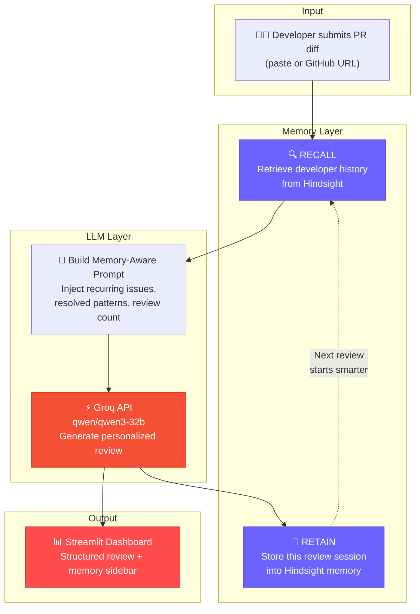

# 🧠 MemoryReview — Code Review Agent That Remembers


> **Traditional code reviewers forget everything between sessions.** MemoryReview doesn't. Powered by the [Hindsight SDK](https://hindsight.vectorize.io), it builds a persistent developer profile across reviews — tracking recurring patterns, celebrating resolved issues, and personalizing feedback that gets sharper with every commit. The result: an AI reviewer that knows your codebase habits and grows with you.

---

## 🏗️ Architecture



---

## 🚀 Quick Start

### 1. Clone the Repository

```bash
git clone https://github.com/Pranavv28/flask-user-api.git
cd flask-user-api
```

### 2. Install Dependencies

```bash
pip install -r requirements.txt
```

### 3. Configure Environment Variables

```bash
cp .env.example .env
```

Edit `.env` and add your API keys:

```env
HINDSIGHT_API_KEY=your_hindsight_api_key_here
HINDSIGHT_SERVER_URL=https://hindsight.vectorize.io
GROQ_API_KEY=your_groq_api_key_here
GITHUB_TOKEN=your_github_token_here   # optional
```

### 4. Seed Demo History (Optional but Recommended)

```bash
python demo/synthetic_history.py
```

This populates 3 past review sessions so the live demo starts at **Review #4** with full memory context.

### 5. Run the App

```bash
streamlit run app/streamlit_app.py
```

---

## 🎬 Demo Script

The `demo/synthetic_history.py` script seeds realistic review history into Hindsight memory to showcase the agent's memory capabilities during a live demo:

| Review | Key Pattern | Purpose |
|--------|------------|---------|
| **#1** | Generic first review | Establishes baseline issues (bare except, hardcoded secrets, missing docstrings) |
| **#2** | Bare except persists, new issues | Shows the agent detecting a **recurring pattern** + new SQL injection vulnerability |
| **#3** | Bare except STILL there, some improvements | Demonstrates 3-review streak tracking + partial improvement acknowledgment |
| **#4** | ✨ **Live demo** | The agent now has full context — watch it reference past patterns in real-time |

---

## 🛠️ Tech Stack

| Component | Technology | Purpose |
|-----------|-----------|---------|
| **Memory** | [Hindsight SDK](https://hindsight.vectorize.io) | Persistent developer memory (recall, retain, reflect) |
| **LLM** | [Groq](https://groq.com) (qwen/qwen3-32b) | Ultra-fast code review generation |
| **UI** | [Streamlit](https://streamlit.io) | Interactive web dashboard |
| **GitHub** | [PyGithub](https://pygithub.readthedocs.io) | Fetch PR diffs directly from repositories |
| **Language** | Python 3.11+ | Core application logic |

---

## 📁 Project Structure

```
hackathon/
├── app/
│   ├── agent.py            # Review orchestrator (recall → prompt → LLM → retain)
│   ├── memory.py           # Hindsight SDK wrapper (recall, retain, reflect)
│   ├── github_utils.py     # GitHub PR diff fetching utilities
│   ├── utils.py            # Parsing, truncation, and helper functions
│   └── streamlit_app.py    # Streamlit UI application
├── demo/
│   ├── synthetic_history.py  # Seed 3 past reviews for demo
│   └── sample_pr_diff.txt    # Sample diff for testing
├── tests/
│   └── test_memory.py       # Unit tests for memory module
├── .env.example             # Environment variable template
├── requirements.txt         # Python dependencies
└── README.md                # You are here
```

---

## ⚙️ How It Works

The review pipeline follows 5 steps, forming a **learning loop** that gets smarter with each review:

```
┌─────────────────────────────────────────────────────────────┐
│                    REVIEW PIPELINE                          │
│                                                             │
│  ① INPUT        Developer submits a code diff (paste or    │
│                  GitHub PR URL)                             │
│                                                             │
│  ② RECALL       Hindsight retrieves the developer's past   │
│                  reviews, recurring issues, and resolved    │
│                  patterns from persistent memory            │
│                                                             │
│  ③ REVIEW       Memory-augmented prompt is sent to Groq    │
│                  (qwen/qwen3-32b) for personalized,        │
│                  context-aware code review                  │
│                                                             │
│  ④ RETAIN       The new review session is stored back      │
│                  into Hindsight memory with structured      │
│                  metadata, tags, and severity counts        │
│                                                             │
│  ⑤ DISPLAY      Streamlit renders the structured review    │
│                  with memory sidebar showing developer      │
│                  history and growth trajectory              │
│                                                             │
│  ♻️ LOOP         Next review starts at ② with enriched     │
│                  memory — every review makes the next       │
│                  one smarter                                │
└─────────────────────────────────────────────────────────────┘
```

### The Memory Advantage

| Without Memory | With Memory (MemoryReview) |
|---------------|--------------------------|
| Same generic feedback every time | Personalized based on developer history |
| Can't detect recurring patterns | Flags issues that persist across reviews |
| No acknowledgment of improvements | Celebrates when past issues are resolved |
| Stateless — forgets everything | Learns and adapts over time |
| One-size-fits-all tone | Adjusts tone based on experience level |

---

## 📄 License

This project is licensed under the **MIT License** — see the [LICENSE](LICENSE) file for details.

---

<p align="center">
  Built with 🧠 memory, ⚡ speed, and ❤️ for better code reviews.
</p>
